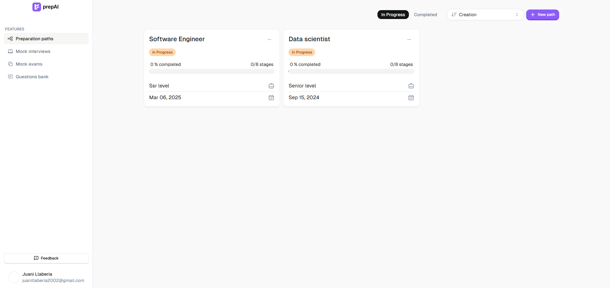

  
  
  
   &nbsp;
  

 
 

  

  <h1 align="center">PrepAI</h3>
  
Dive into AI fully customizable paths based on your needs to land your next job with AI generated challenges. Try it out below...

  

     
    <a href="https://www.prepai.app/">View Demo</a> 
    &middot;
    <a href="https://www.prepai.app/">Report Bug</a>
    &middot;
    <a href="mailto:juanillaberia2002@gmail.com">Contact us</a>
  

## About The Project

Preparing for interviews is tough, but with **PrepAI**, you can supercharge your preparation using the power of **AI (Gemini)**.  
**PrepAI** allows you to create and take mock interviews, exams, and follow guided paths through key topics and units. Plus, our question bank helps you practice specific interview questions with AI-powered feedback.  

 

## 🏆 Special Mention  

**PrepAI** was built for the **Gemini API Developer Competition by Google (2024)**!  
A huge thanks to Google for hosting such an incredible competition.

 

## 🌟 Why PrepAI?  

🚀 **AI-Powered Interview Prep** – Let Gemini guide you through your interview journey  
🎯 **Create and Take Interviews** – Simulate real-life interview scenarios  
📚 **Structured Learning Paths** – Follow a clear learning path to cover all relevant topics  
🔍 **Question Bank** – Practice specific interview questions with AI-generated answers  
⚡ **Track Your Progress** – Measure your improvement over time with built-in metrics  

## 🚀 Get Started  

1️⃣ **Sign up** and create your profile  
2️⃣ **Choose an interview path** to get started or create your own mock interview  
3️⃣ **Take exams** and get AI feedback to know where to improve  
4️⃣ **Practice specific questions** using our AI-powered question bank  

> **💡 PrepAI is your ultimate AI-powered tool to prepare for interviews efficiently and effectively!**  

 

## 📌 Features  

✅ **AI-Generated Mock Interviews** – Simulate interviews with questions tailored to your skills  
✅ **Learning Paths** – Follow structured paths through interview topics and units  
✅ **Customizable Question Bank** – Choose from a vast array of questions to practice  
✅ **Progress Tracking** – Track your preparation and measure your improvement  
✅ **Real-Time AI Feedback** – Get personalized feedback for every answer  

 

## 🛠 Built With  

  
  
  
  
  

 

